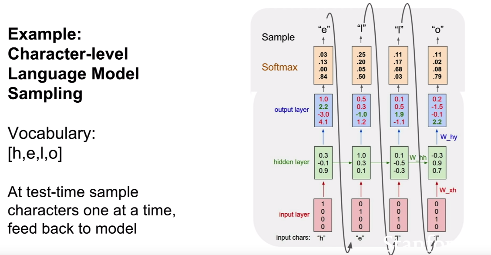

# ***Deep Learning***

## Table of Content
<!-- TOC depthFrom:3 -->

- [Deep Learning Overview](#overview)
- [Convolutional Neural Network](#Convolutional_Neural_Network)
  * [Step 1 - Convolution Operation](#ConvolutionOperation)
  * [Step 1b - ReLU layer](#Relu)
  * [Step 2 - Pooling](#Pooling)
  * [Step 3 - Flattening](#Flattening)
  * [Step 4 - Fully Connected Layer](#FC)
  * [Architectures](#cnn_arch)
  * [Links](#cnn_links)
  * [Mathematical summery](#math_cnn)
  * [Hyperparameter Optimizing](#hyperparameters)
- [Recurrent Neural Network](#rnn)
  * [General description](#gen_descr_rnn)
  * [Vanishing Gradient Problem](#vanishing)
  * [Sequence-to-Sequence](#seq2seq)
  * [Long-Short-Term-Memory (LSTM)](#lstm)
- [Self-Organizing-Maps](#som)
    * [General description](#gen_descr_som)

<!-- /TOC -->

## ***Deep Learning Overview***
<table><tr><td>

</td></tr></table>

## ***Convolutional Neural Network***

- CNN is a special type of multilayer neural network
- To keep spatial structure in an image (not flatten information to a 1D vector as in fully connected networks)
- CNNs are used to recognize visual patterns directly from pixel images with variability
- trained with the back-propagation algorithm
- transforms a raw image data from input layer to output layer
- gets image as an input and produces a label as output
- normal Artificial Neural Networks (ANN) take 1D array as input, that's why normal ANN do not scale very well for images because images are 2D structures (image = matrix of pixels)
- for RGB (red/green/blue) its a 3D structure. Each color gets a 2D array

 

The overall architecture looks as follows:

<table><tr><td>

</td></tr></table>

#### Step 1 - Convolution Operation / Kernel / Filter / Feature Detector

* Application of multiple feature-detectors or filters to get multiple feature maps or activation maps
* number of filters == number activation maps
* Filters slide over the image spatially and computing dot products
  - Matrix A = filter (i.e. 32x32 for RGB so 32x32x3)
  - Matrix B = Section of image covered by filter (here 32x32)
  - A .product B = Number
* The number of pixels by which we slide the kernel is known as the stride. (stride 1 = moving filter by one pixel)
* The stride is usually kept as 1, but we can increase it. When increased, we might have to increase the size of the image by a few pixels to fit in the filter at the edges of the image. This increase is called padding.

Following image shows just application of a single filter or feature-detector because of simplicity reasons:

<table><tr><td>

</td></tr></table>

Why this step?
1. Find features (feature maps) such as nose, eyes, edges etc. in your image.
2. Reduce size of image for easier and faster processing. Imagine you have an image size of 256x256 or even higher. Some information are lost but most important information and spatial relations are preserved.
3. Focus on most important features of an image such as nose, eyes, mouth etc. and ignore unimportant details. So same behavior as humans.

  [ae388dda]: https://www.saama.com/blog/different-kinds-convolutional-filters/ "Convolution Filters"

In this step many feature detectors will be applied:

<table><tr><td>

</td></tr></table>  

What feature detector to use?
There are several feature detectors out there such as Emboss, Edge Detect, Sharpen, Blur etc. but the machine will decide what feature detector will be applied during learning. More on filters see here [Convolution Filters][ae388dda] .

For a real image it could look like this:

<table><tr><td>

</td></tr></table>  

#### Step 1b - ReLU layer

Additional step in Convolution step:

<table><tr><td>

</td></tr></table>  

Why this step? Breaking up linearity !

<table><tr><td>

</td></tr></table>  

#### Step 2 - Pooling

<table><tr><td>

</td></tr></table>

Why this step?
- To achieve spatial invariance by reducing
the resolution of the feature maps! Meaning that a key feature (i.e. nose of humans, wheels of a car) is independent where and how this feature is located/presented in the image. So it shouldn't matter whether the "nose" is at the bottom, top or left/right corner of an image. Also the size and position (if its a bit rotated) of the key feature is unimportant. Just if the key feature is available is important.
- And also again reducing the size and number of parameters which is important to prevent overfitting.

Most important types of pooling functions:
- Max function - take the maximum value from feature map
- Subsampling function - kind of special average pooling from feature map

#### Step 3 - Flattening

Flatten 2D array to 1D array:

<table><tr><td>

</td></tr></table>

Why this step?

- For further processing in another neural network. Common ANNs work with 1D array as input.

Following image shows all layers until the flattening step:

<table><tr><td>

</td></tr></table>

#### Step 4 - Full Connection

Adding an entire ANN after flattening step! All previous steps are responsible to detect features from the image.

<table><tr><td>

</td></tr></table>

Why this step?
- After flattening we have now specific attributes which can be classified now by a common ANN.
- Leveraging previous steps to predict/classify (Is it a cat or dog?) based on attributes.

<table><tr><td>

</td></tr></table>

### Architectures

- ResNet (2015) - "Revolution of Depth"
   - 152 Layers using "Residual connections"
   - has >1 residual blocks
   - No FC Layers
   <table><tr><td>
   
   </td></tr></table>
- GoogLeNet (2014) - 22 layers
   - No FC Layers
   - efficient "Inception module"
   - only 5 million parameters
   <table><tr><td>
   
   </td></tr></table>
- VGGNet (2014) - more layers but smaller filters (3x3 filter)
   - VGG16Net - 16 layers
   - VGG19Net - 19 layers
   <table><tr><td>
   
   </td></tr></table>
- ZFNet (2013) just optimizing hyper-parameters of AlexNet
- AlexNet (2012)
   - 8 layers (just counting Conv/MaxPool layers)
  <table><tr><td>
  
  </td></tr></table>

### Links

* [CNN Visualizer](http://scs.ryerson.ca/~aharley/vis/conv/flat.html)

* [Best explanation of Convolutional Neural Networks](https://medium.com/technologymadeeasy/the-best-explanation-of-convolutional-neural-networks-on-the-internet-fbb8b1ad5df8)

* [Great explanation of CNN](https://ujjwalkarn.me/2016/08/11/intuitive-explanation-convnets/)

* [More precise explanation of CNN](https://adeshpande3.github.io/A-Beginner%27s-Guide-To-Understanding-Convolutional-Neural-Networks/)

* [Stanford University -  How CNN works][edcbdd81]

  [edcbdd81]: https://www.youtube.com/watch?v=bNb2fEVKeEo&index=5&list=PL3FW7Lu3i5JvHM8ljYj-zLfQRF3EO8sYv "Stanford University -  How CNN works"

### Mathematical summery

* CNN accepts a volume (image + depth i.e. 3 for RGB) of size Width x Height x Depth - `W x H x D`
* Requires hyperparameters:
  - Number of filters `K`
  - their spatial extend `F` (filter size)
  - the stride `S`
  - amount of zero padding `P`
* Produces a feature map of size `W1 x H1 x D1`
  - `W1 = H1 = (W - F + 2*P) / S + 1`
  - `D1 = K`
    - Example:
      - Input volume `W x H x D`: 227x227x3
      - Filter size `F`: 11x11
      - Number of filters `K` : 96
      - Stride `S`: 4
      - Pad: `P`: 0
      - Result: `W1 = H1 = (227 - 11 + 2*0) / 4 + 1 = 55, D1 = 96 -> 55x55x96`
        - so in other words the result is 96 activation maps with size of 55x55
* Total number of parameters (per ConvLayer):
  - `(F x F x D) x K`
    - Example:
      - Input volume `W x H x D`: 32x32x3
      - Filter size `F`: 5x5
      - Number of filters `K` : 10
      - Stride `S`: 1
      - Pad: `P`: 2
      - Result: `(5 x 5 x 3) x 10 = 750 parameters`

### Hyperparameter Optimizing

#### Learning rate
Learning rate controls how much to update the weight in the optimization algorithm. We can use fixed learning rate, gradually decreasing learning rate, momentum based methods or adaptive learning rates, depending on our choice of optimizer such as SGD, Adam, Adagrad, AdaDelta or RMSProp.

#### Number of epochs
Number of epochs is the the number of times the entire training set pass through the neural network. We should increase the number of epochs until we see a small gap between the test error and the training error.

#### Batch size
Mini-batch is usually preferable in the learning process of ConvNet. A range of 16 to 128 is a good choice to test with. We should note that ConvNet is sensitive to batch size.

#### Activation function
Activation function introduces non-linearity to the model. Usually, rectifier works well with ConvNet. Other alternatives are sigmoid, tanh and other activation functions depending on the task.

#### Weight initialization
We should initialize the weights with small random numbers to prevent dead neurons, but not too small to avoid zero gradient. Uniform distribution usually works well.

#### Dropout for regularization
Dropout is a preferable regularization technique to avoid overfitting in deep neural networks. The method simply drops out units in neural network according to the desired probability. A default value of 0.5 is a good choice to test with.

#### Grid search or randomized search
Manually tuning hyperparameter is painful and also impractical. There are two generic approaches to sampling search candidates. **Grid Search** exhaustively search all parameter combinations for given values. **Random Search** sample a given number of candidates from a parameter space with a specified distribution.

To implement grid search more efficiently, it is better to start with coarse ranges of hyperparameter values in the initial stage. It is also helpful to perform coarse grid search for smaller number of epochs or smaller training set. The next stage would then perform a narrow search with more epochs or entire training set.

Although grid search is useful in many machine learning algoirthms, it is not efficient in tuning hyperparamter for deep neural network as the number of parameters increases, computation grows exponentially. Random search has been found more efficient compared to grid search in hyperparameter tuning for deep neural netwlork (see Paper on “Random Search for Hyper-Parameter Optimization”). It is also helpful to combine with some manual tuning on hyperparameters based on prior experience.

* [Hyperparameter Optimization with Keras][512114de]

  [512114de]: https://towardsdatascience.com/hyperparameter-optimization-with-keras-b82e6364ca53 "Hyperparameter Optimization with Keras"
* [Random Search for Hyper-Parameter Optimization][3a271e1d]

  [3a271e1d]: http://www.jmlr.org/papers/volume13/bergstra12a/bergstra12a.pdf "Random Search for Hyper-Parameter Optimization"
* [How to Grid Search Hyperparameters for Deep Learning Models in Python With Keras][ceee06ac]

  [ceee06ac]: https://machinelearningmastery.com/grid-search-hyperparameters-deep-learning-models-python-keras/ "How to Grid Search Hyperparameters for Deep Learning Models in Python With Keras"
* [A Comprehensive List of Hyperparameter Optimization & Tuning Solutions][8157f227]

  [8157f227]: https://medium.com/@mikkokotila/a-comprehensive-list-of-hyperparameter-optimization-tuning-solutions-88e067f19d9 "A Comprehensive List of Hyperparameter Optimization & Tuning Solutions"

* [Random Search for Optimal Parameters][f48cb676]

  [f48cb676]: https://statcompute.wordpress.com/2017/04/10/random-search-for-optimal-parameters/ "Random Search for Optimal Parameters"

## ***Recurrent Neural Network***

### General Description

Normal ANN just take a fixed size of input and generate a fixed size of output. When we want to have a variable size of input and output then we need something more flexible. Here comes RNN into play. They are the paradigm for handling variable sized sequence data in in-and output.

There are different kind of RNN models:
* **one-to-many**
  - Image-Captioning - fixed size of input image and a variable size of output such as a caption of this image
* **many-to-one**
  - Sentiment Classification - input size is variable such as a text and the output is fixed such as the sentiment of this text (i.e. positive or negative)
* **many-to-many**
  - Machine Translation - input and output is variable (sequence of german words -> sequence of english words)
  - Video Classification on Frame level

RNN maintains a hidden state `h` which will updated once new input comes in.
<table><tr><td>

</td></tr></table>

The easiest type of RNN could look like this :
<table><tr><td>

</td></tr></table>

* `Whh`, `Wxh` and `Why` are weight-matrices
* `tanh()` function to achieve non-linearity

You can see the process of updating of the hidden state also as follows:

<table><tr><td>

</td></tr></table>

* `h0` is initial sate / `xn` is the input sequence i.e. sentence
* every time an input `x` comes in, the state `hn , {n=0, n++}` gets updated which results in the new state `hn+1` and so on
* now we will apply also the weight matrix `W` which will be used at every timestamp of computation. See the following picture:

<table><tr><td>

</td></tr></table>

### Sequence-to-Sequence
* Special kind of RNN is **Sequence-to-Sequence**. You can think of the model as a combination of Many-to-one + one-to-many RNN:
<table><tr><td>

</td></tr></table>
This model can be used to predict letters / words in sequences of characters. See the following example for the prediction of the next letter using a Seq2Seq-Model.

<table><tr><td>

</td></tr></table>

### Image Captioning with CNN and RNN
The CNN detects the dense vector of features in the image like *hat* or *man*. Then this output will be used as in put for the RNN.
<table><tr><td>

</td></tr></table>

### Long-Short-Term-Memory (LSTM)
Long Short Term Memory networks – usually just called “LSTMs” – are a special kind of RNN, capable of learning long-term dependencies.

See also [Explenation LSTM][69e2a250]

  [69e2a250]: http://colah.github.io/posts/2015-08-Understanding-LSTMs/ "Explenation LSTM"

<table><tr><td>

</td></tr></table>

## ***Self-Organizing-Maps***

### General Description

* Unsupervised (unlabled data) Deep Learning Algorithm
* Clustering Algorithm
* Used for reducing dimensions for input data (Reduce amount of columns)

<table><tr><td>

</td></tr></table>

### Refreshing K-Means-Clustering

<table><tr><td>

</td></tr></table>

#### Steps for K-Means

<table><tr><td>

</td></tr></table>

<table><tr><td>

</td></tr></table>

<table><tr><td>

</td></tr></table>

<table><tr><td>

</td></tr></table>

<table><tr><td>

</td></tr></table>

Final step:
<table><tr><td>

</td></tr></table>

### How SOM learn

* No activation function
* weights are directly assigned to neurons

Introduction video 1: [Video Introduction SOM][093a2460]

  [093a2460]: https://www.youtube.com/watch?v=H9H6s-x-0YE "Video Introduction SOM"

Introduction video 2 :
[  Video 2 Introduction SOM][66ea0806]

  [66ea0806]: https://www.youtube.com/watch?v=0qtvb_Nx2tA "Video 2 Introduction SOM"
